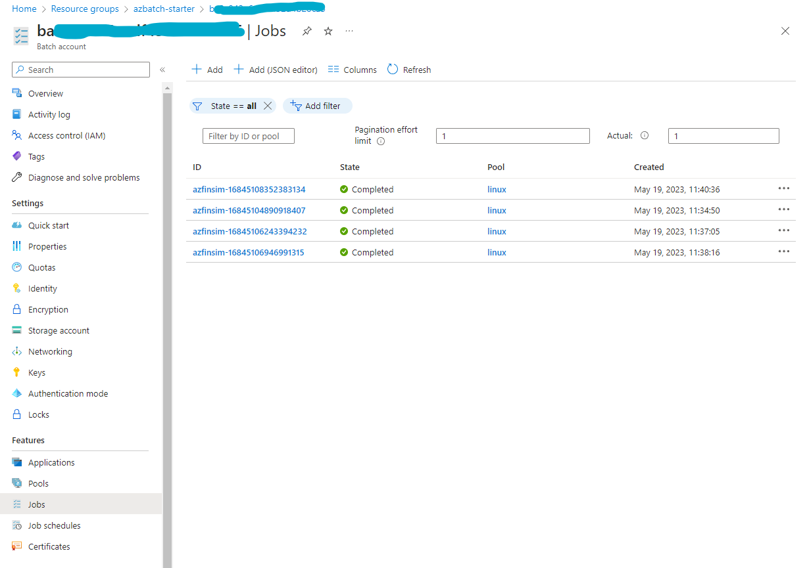
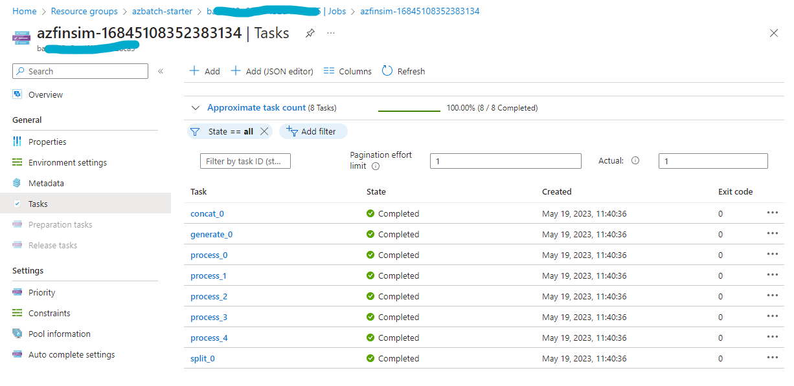

# Understanding AzFinSim

In this document we will dig into the AzFinSim application and understand how it works.
We will also look at various tools available for monitoring the application and inspecting the results
within the Azure ecosystem.

AzFinSim is a simple Python application for synthetic risk simulation. It is designed to be used as a demo for
Azure services, but can also be used as a standalone application.
The source code is available on [GitHub](https://github.com/utkarshayachit/azfinsim)

## Job details

Let's start by understanding the nature of the job we submit when we use the `sb azfinsim ...` command supported by
the [Command Line Interface (CLI)](cli.md). The command takes a number of parameters that control the job. The CLI
Python code takes these parameters and converts them to a job submission by calling the Azure Batch Python SDK.

Every time you call `sb azfinsim ...`, a new job is submitted. The job is named `azfinsim-<unique-id>` where
`<unique-id>` is a unique identifier generated by the CLI. The job is submitted to the Azure Batch account
located in the resource group specified by the `--resource-group` parameter. A typical job has the following
tasks:

* `generate_0` task generates the synthetic trades and writes them to a CSV file. The total number of trades generated
  is controlled by the `--num-trades` parameter.
* `split_0` task splits the generated trades CSV files into multiple files. The intent is to split the trades processing
  work among multiple tasks by splitting the trades into multiple files and then processing each file concurrently.
  The number of files is controlled by the `--num-tasks` parameter. Since this task has to run after the `generate_0` task,
  it is dependent on the `generate_0` task. Using task dependencies ensures that all required tasks are completed before
  a dependent task is started.
* `process_*` tasks process the trades in the split files generated by the `split_0` task. Each task processes one file and
  stores the result in another CSV file. These tasks are designed to run concurrently, independent of each other. Tasks dependencies
  are used here too to ensure that these tasks are started only after the `split_0` task is completed successfully.
* Finally, the `concat_0` task merges the results from all the `process_*` tasks and stores the result in a single CSV file.
  This task is dependent on all the `process_*` tasks.

The job supports concurrent tasks and the job can potentially run on pools with multiple compute nodes. This means that for the
I/O to work, all nodes must have access to a shared filesystem to read/write from/to. This is achieved by mounting a storage account
on the compute nodes (blob or azure file share). The mount point can be specified using the optional `--data-dir` argument. If not
specified, on Linux compute nodes,  `$AZ_BATCH_NODE_SHARED_DIR/data` is used while on Windows compute nodes, `l:` is used as the mount point for the shared storage.

> __TODO__:
>
> * using existing trades file
> * accessing synthetic trades and results files from storage account

## Using Azure Portal

In this section, we will discuss how to use the Azure Portal to monitor the job and inspect the results.

### Locating the resource group and resources

When you create a deployment, you pass a string for a parameter named `resourceGroupName`.
This string is the name of the resource group that contains all the resources created by the deployment.
First things first, let's locate the resource group in the Azure Portal. Once you have logged into the Azure Portal,
you can search for the resource group by typing its name in the search box at the top of the page. Or you can navigate
to the **Resource Groups** page by selecting **Resource Groups** from the left navigation bar. This will show you a list
of all resource groups in your subscription. You can then select or search for the resource group we created in our
deployment. Refer to the
[Azure documentation](https://learn.microsoft.com/en-us/azure/azure-resource-manager/management/manage-resource-groups-portal)
for details on how to locate a resource group in the Azure Portal.

Once you have located the resource group, you can see all the resources created by the deployment. The following image
shows some of the major resources created using the default configuration deployed with
`enableApplicationContainers` parameter set to `true`.

You can navigate to the **Batch Account** resource to inspect pools, jobs, tasks, etc. The following image shows jobs
run on the deployment as part of a test suite run. Each job submission using the `sb azfinsim ...` command creates a new
job. The job name is `azfinsim-<unique-id>` where `<unique-id>` is a unique identifier generated by the CLI.

Navigating to one of the jobs shows you the details of all the tasks submitted as part of the job. Refer back to the
[Job Details](#job-details) section for details on the tasks submitted as part of the job.

You can use these pages to monitor the jobs and tasks as they are executing as well. The pages can be refreshed
as the job executes to see the latest outputs and statuses from the tasks and jobs.

## Using Azure Batch Explorer

> __TODO__: add notes about using Azure Batch Explorer for monitoring the job.
